# golang_depoly_exercise

웹서버를 만들고 이를 github-action ci로 unit-test를 진행할 것이다.
이후에 AWS ECR에 올리는 과정까지 알아보자.

이 저장소는 https://youtube.com/playlist?list=PLy_6D98if3ULEtXtNSY_2qN21VCKgoQAE 에 나온 내용을 공부하여 일부를 정리한 것이다.

## Golang github action
### 간단한 테스트용 웹서버 만들기
데모 프로젝트 저장소는 여기서 확인하면 된다.
https://github.com/jiny0x01/golang_depoly_exercise


프로젝트 디렉토리를 생성하고 초기화 해준다.
> mkdir golang_deploy_exercise

> cd golang_deploy_exercise; go mod init golang_deploy_exercise; go mod tidy

웹서버에 쓸 gin과 unit test에 사용할 testify를 추가한다.

gin
> go get -u github.com/gin-gonic/gin

testify 
> go get github.com/stretchr/testify


```go
// main.go
package main

import (
	"net/http"

	"github.com/gin-gonic/gin"
)

type sumRequest struct {
	A int `json:"a" binding:"required"`
	B int `json:"b" binding:"required"`
}

func sum(a, b int) int {
	return a + b
}

func sumHandler(c *gin.Context) {
	var req sumRequest
	if err := c.ShouldBindJSON(&req); err != nil {
		c.JSON(http.StatusUnprocessableEntity, gin.H{
			"error": err.Error(),
		})
		return
	}

	result := sum(req.A, req.B)

	c.JSON(http.StatusOK, gin.H{
		"result": result,
	})
}

func main() {
	r := gin.Default()
	r.GET("/ping", func(c *gin.Context) {
		c.JSON(http.StatusOK, gin.H{
			"message": "pong",
		})
	})
	r.POST("/sum", sumHandler)

	r.Run()
}
```

```go
//main_test.go
package main

import (
	"bytes"
	"encoding/json"
	"net/http"
	"net/http/httptest"
	"testing"

	"github.com/gin-gonic/gin"
	"github.com/stretchr/testify/require"
)

func TestSum(t *testing.T) {
	testCases := []struct {
		name          string
		body          gin.H
		checkResponse func(t *testing.T, recorder *httptest.ResponseRecorder)
	}{
		{
			name: "OK",
			body: gin.H{
				"a": 10,
				"b": 20,
			},
			checkResponse: func(t *testing.T, recorder *httptest.ResponseRecorder) {
				require.Equal(t, http.StatusOK, recorder.Code)
			},
		},
		{
			name: "UnprocessableEntity",
			body: gin.H{
				"a": 10,
				"c": 50,
			},
			checkResponse: func(t *testing.T, recorder *httptest.ResponseRecorder) {
				require.Equal(t, http.StatusUnprocessableEntity, recorder.Code)
			},
		},
	}

	for i := range testCases {
		tc := testCases[i]

		t.Run(tc.name, func(t *testing.T) {
			router := gin.Default()
			router.POST("/sum", sumHandler)
			recorder := httptest.NewRecorder()

			data, err := json.Marshal(tc.body)
			require.NoError(t, err)

			url := "/sum"
			request, err := http.NewRequest(http.MethodPost, url, bytes.NewReader(data))
			require.NoError(t, err)
			router.ServeHTTP(recorder, request)
			tc.checkResponse(t, recorder)
		})
	}
}
```

***/sum***에 POST 요청으로 ***a***와 ***b***를 보내면 a+b를 반환해주는 간단한 웹서버다.
아래 명령어로 전체 테스트를 진행할 수 있다.

> go test -v ./...

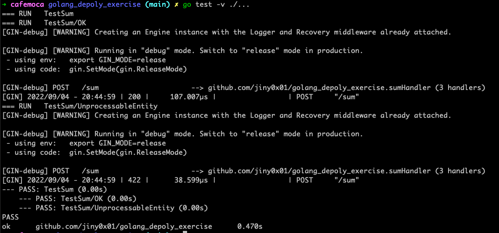


이제 github repo에서 actions 탭에서 Go 템플릿을 살짝 수정할거다.
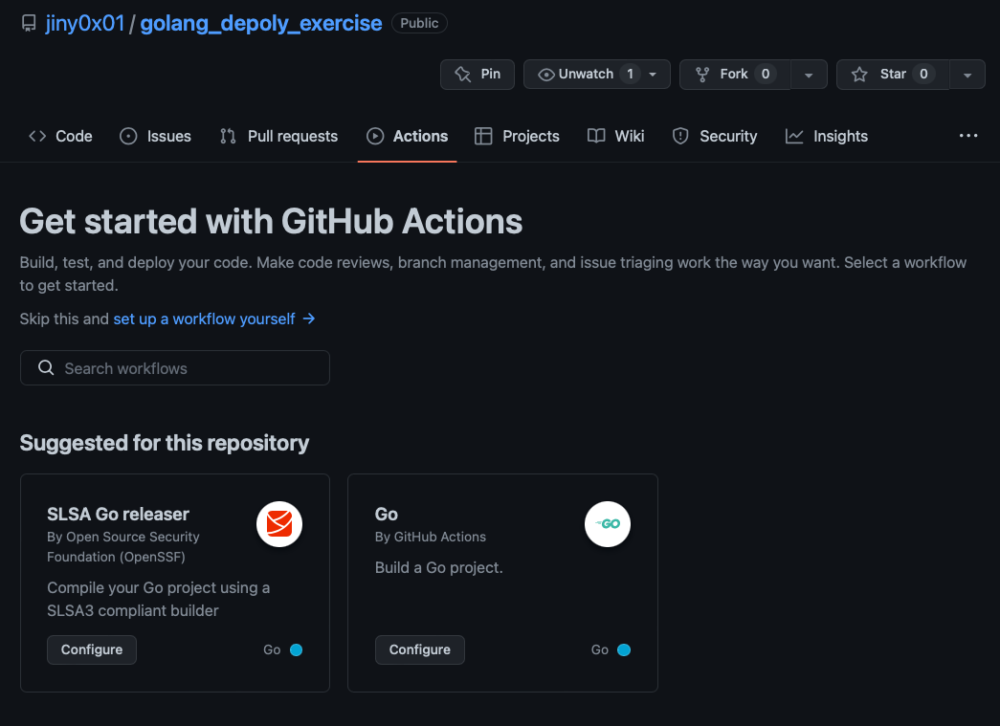

```yaml
# .github/workflows/test.yml
name: Run unit test

on:
  push:
    branches: [ "main" ]
  pull_request:
    branches: [ "main" ]

jobs:

  test:
    name: Test
    runs-on: ubuntu-latest
    steps:
    - uses: actions/checkout@v3

    - name: Set up Go
      uses: actions/setup-go@v3
      with:
        go-version: 1.18

    - name: Test
      run: go test -v ./... # ./...는 현재 디렉토리 아래에 있는 모든 것을 의미
```


모든 파일들을 다 추가하고 push하면 된다.
```
```bash
git add .
git commit m -m "Add unit test"
git push
```

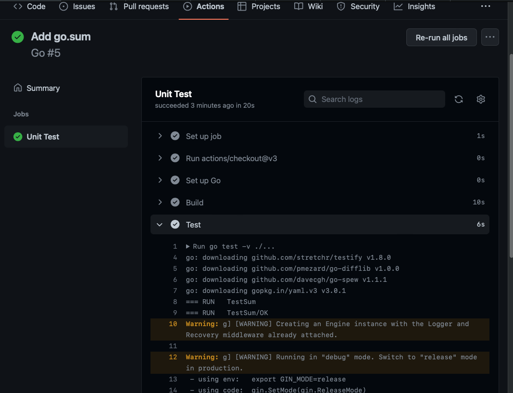


#### workflow
workflow에는 job이 존재하며 한 job에는 여러 step이 있다.
각각의 job은 병렬로 동작하거나 순서에 맞춰 동작할 수 있다. 
하나의 job은 여러개의 step을 갖고 있을 수 있다.

##### step
각각의 step에는 1개 이상의 action이 존재한다. 
github action에서 알고 넘어가야할 부분은 job과 step이다.

 + https://docs.github.com/en/actions/using-jobs/using-jobs-in-a-workflow

앞서 본 unit test는 단순히 ubuntu 환경에서 golang을 set-up하고 go test를 실행한 것이 전부다.
추가적인 작업이 필요하다면 name을 정해주고 어떤 명령을 수행할지 run에서 정의해주면 된다.
```yaml
- name: build
  run: go build -v
```

action에 대해 더 깊게 이해하고 싶다면 아래 공식문서의 설명을 읽어보자
https://docs.github.com/en/actions/learn-github-actions/understanding-github-actions#the-components-of-github-actions


# ECR Build
위에서 만든 서버 애플리케이션을 ECR(Elastic Container Registry)에 배포 해볼 것이다. 


### Dockerfile & docker-compose 작성

우선 Dockerfile을 작성해준다.
```Dockerfile
#Dockerfile

#Build stage 
FROM golang:1.18.5-alpine3.16 AS builder 
WORKDIR /app COPY . . 
RUN go build -o main main.go 

# Run stage 
FROM alpine:3.16 
WORKDIR /app COPY --from=builder /app/main . 
EXPOSE 8080 
CMD [ "/app/main" ]
```

FROM을 2개 쓰는 이유가 궁금하면 여기로 
+ (multi stage build)[https://cafemocamoca.tistory.com/320]

docker-compose를 사용하여 서버 애플리케이션을 실행할 것이다.

```yaml
# docker-compose.yml
version: "3.9"
services:
  app:
    build:
      context: .
      dockerfile: Dockerfile
    ports:
      - "8080:8080"
    command: [ "/app/main" ]
```

아래 명령어를 실행하면 잘 작동하는 것을 확인할 수 있다.
> docker-compose up

### AWS ECR
aws에 로그인하고 ECR을 검색한 후 private으로 repo를 생성한다.
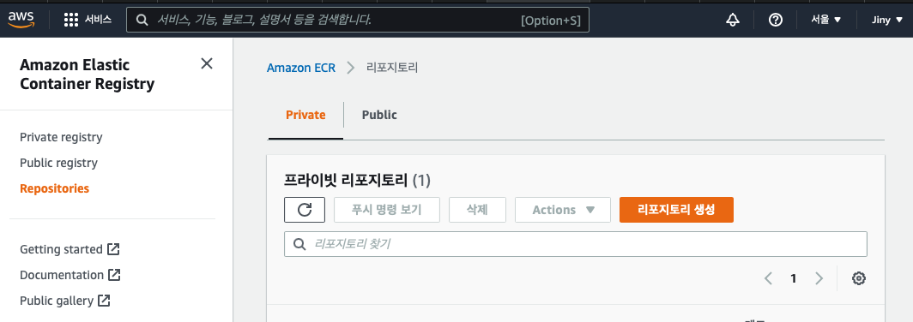

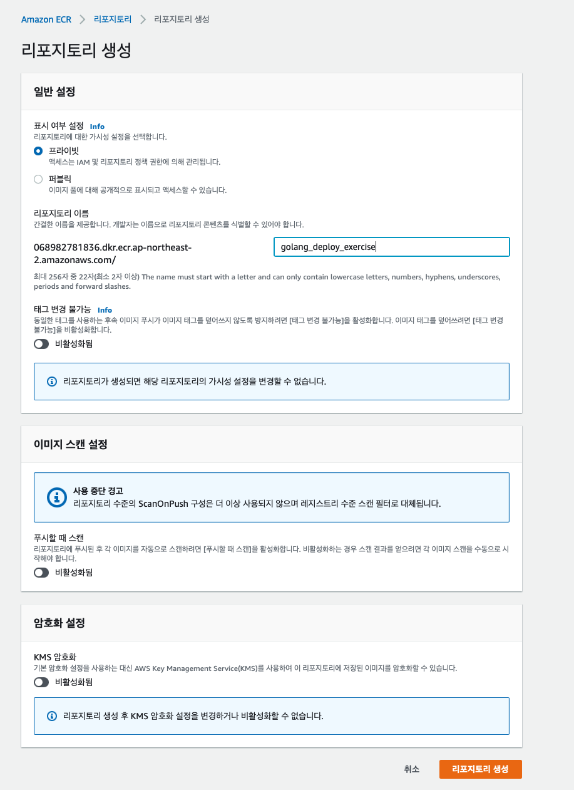

repository가 생성되면 상단에 푸쉬 명령 보기 팝업이 뜬다.
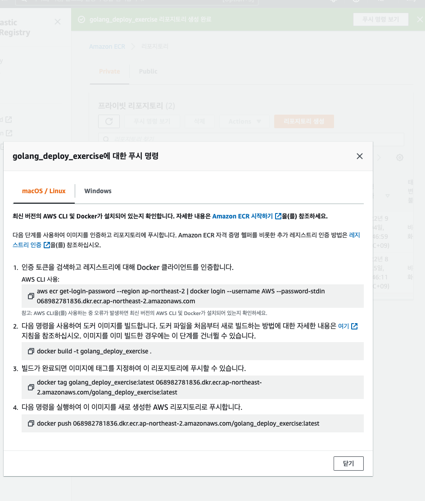

아까 작성한 docker-compose를 ecr에 올리기 위해 workflow를 하나 더 만들어준다.
작성 방법은 아래 링크를 참조하여 작성한다. 우리의 repository가 private 점을 기억하자.
+ https://github.com/marketplace/actions/amazon-ecr-login-action-for-github-actions

```yaml
# .github/workflows/deploy.yml
name: Deploy to production 

on:
  push:
    branches: [ main ]

jobs:

  build:
    name: Build image 
    runs-on: ubuntu-latest

    steps:
    - name: Check out code 
      uses: actions/checkout@v3

    - name: Configure AWS credentials
      uses: aws-actions/configure-aws-credentials@v1
      with:
        aws-access-key-id: ${{ secrets.AWS_ACCESS_KEY_ID }} # github>repo에서 추가
        aws-secret-access-key: ${{ secrets.AWS_SECRET_ACCESS_KEY }} # 위와 동일
        aws-region: ap-northeast-2  # 리전을 서울로 설정해주자

    - name: Login to Amazon ECR
      id: login-ecr
      uses: aws-actions/amazon-ecr-login@v1

    - name: Build, tag, and push docker image to Amazon ECR
      env:
        REGISTRY: ${{ steps.login-ecr.outputs.registry }}
        REPOSITORY: golang_deploy_exercise  # ecr 레포 이름
        IMAGE_TAG: ${{ github.sha }}
      run: |
        docker build -t $REGISTRY/$REPOSITORY:$IMAGE_TAG .
        docker push $REGISTRY/$REPOSITORY:$IMAGE_TAG
```

action이 aws에 접근할 수 있게 설정 해야한다. 
AWS IAM(Identity and Access Manager)에서 사용자를 추가해준다.
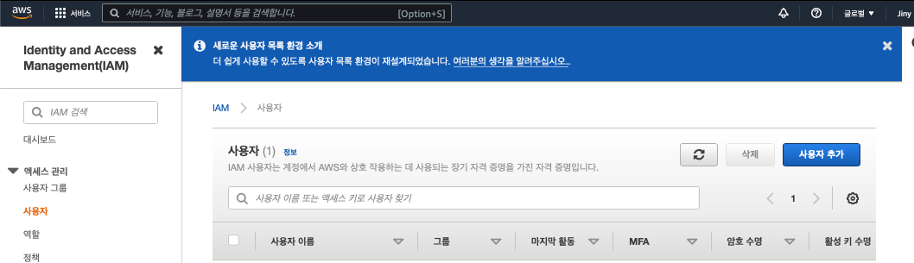
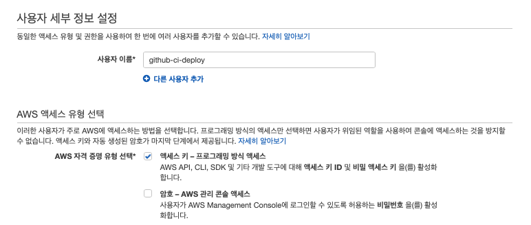

사용자를 그룹에 추가하기 위해 우선 그룹을 먼저 만든다.
그룹의 권한은 ECR에 접근할 수 있도록 EC2ContainerRegistryFullAccess를 적용해주고 다음으로 넘어간다.
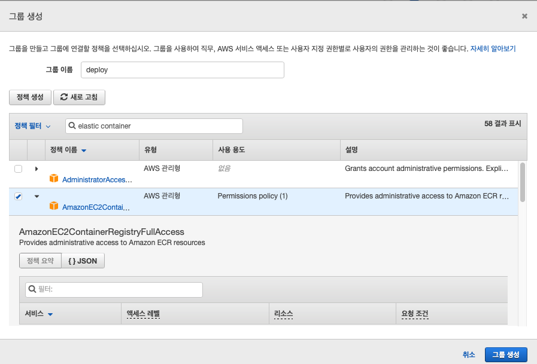

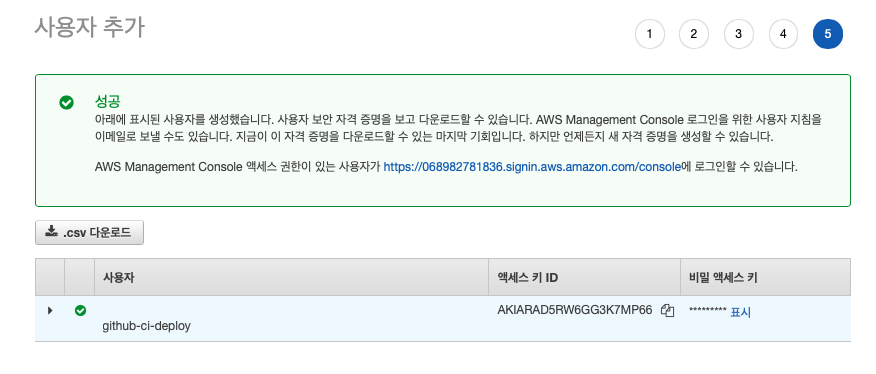
생성된 Access Key ID와 Secret Access ID를 github 저장소에 설정하면 action이 이를 바탕으로 deploy.yml에 값을 적용할 수 있다.

아까 deploy.yml에서 credentials 쪽을 보면 ```secrets.AWS_ACCESS_KEY_ID```와 ```secrets.AWS_SECRET_ACCESS_KEY```가 보인다.
```yaml
    - name: Configure AWS credentials
      uses: aws-actions/configure-aws-credentials@v1
      with:
        aws-access-key-id: ${{ secrets.AWS_ACCESS_KEY_ID }}
        aws-secret-access-key: ${{ secrets.AWS_SECRET_ACCESS_KEY }}
        aws-region: ap-northeast-2  # 리전을 서울로 설정해주자

```

repository > settings > Actions에서 access key와 secret key를 이름을 맞춰서 추가해준다.
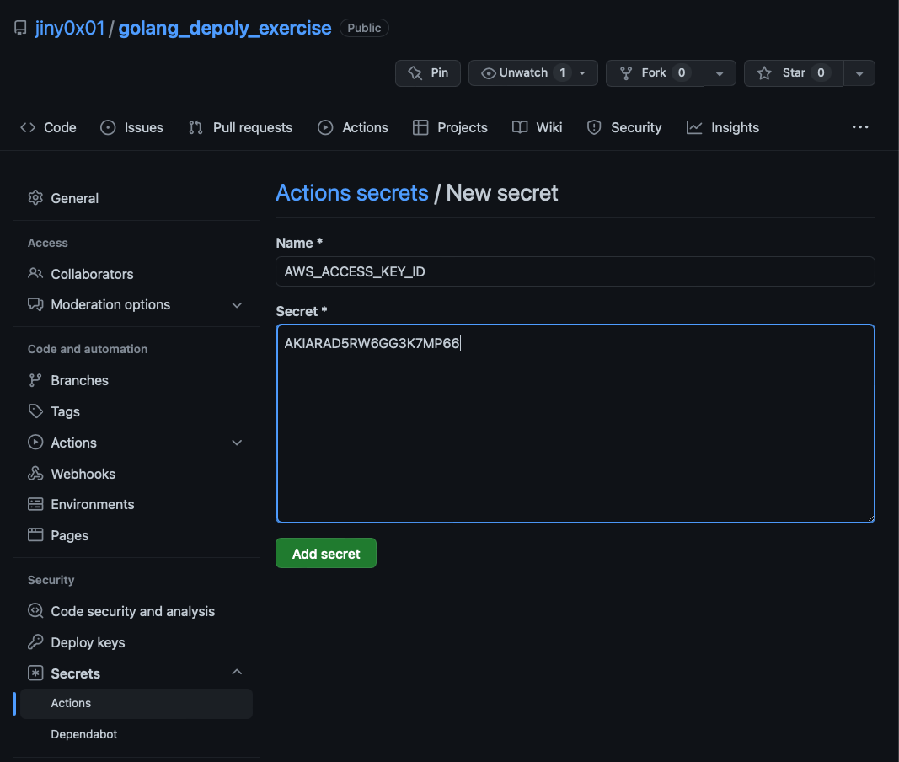

여기까지 진행하고 파일들을 add-commit-push하면 ECR에 잘 올라간 모습을 볼 수 있다.

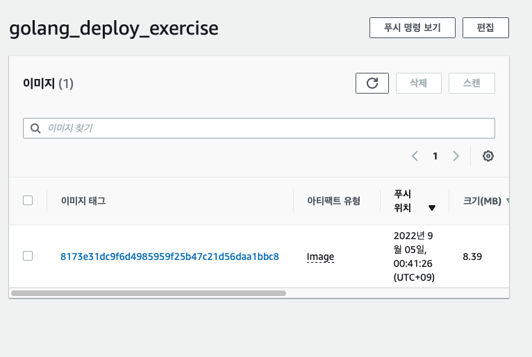
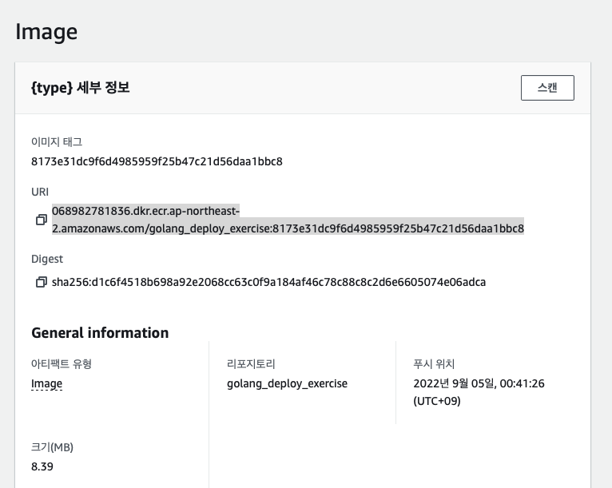
컨테이너 크기도 8.39MB로 매우 tiny한 것을 볼 수 있다.
컨테이너의 URI:8080/sum으로 request를 보내면 모든게 잘 될 것 같지만 처음에 private repo로 만들어서 request를 보낼 수 없다. public으로 진행한다면 문제없이 작동할 것이다.

private repo에 request를 보내기 위해선 추가 작업이 필요하다.
aws-cli로 ecr에 로그인하여 접근할 수 있게 설정한후 로컬에 ECR이미지를 pull 하여 거기에 요청을 보내면 된다.

https://aws.amazon.com/ko/cli/
aws-cli 설치는 pip로 진행한다.
> pip install awscli

우선 AWS IAM에서 사용자 > github-ci-deploy > 보안 자격 증명에서 엑세스 키를 새로 만든다.
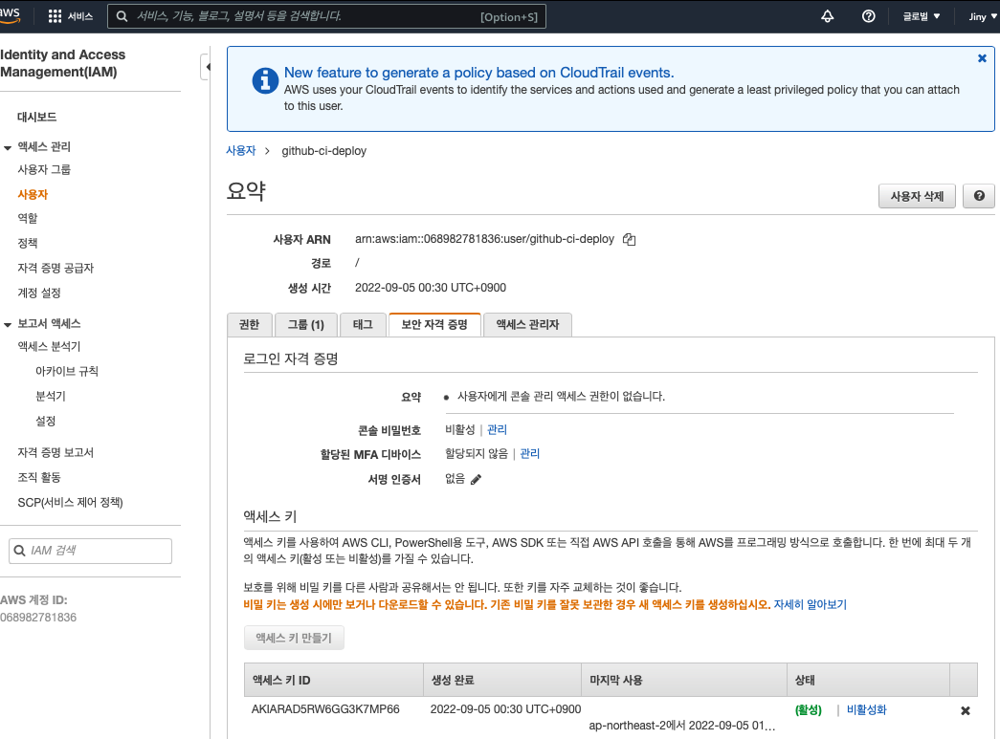

만들어진 access key와 secret key를 aws configure에 입력해준다
> aws configure

default region은 서울에 해당하는 리전으로,
output format은 json으로 해준다.


> aws ecr get-login-password --region ap-northeast-2 | docker login --username AWS --password-stdin [ECR URI]

ECR URI를 입력할 때 ~region.amazonaws.com/~  이런식으로 되어 있다.
> 068982781836.dkr.ecr.ap-northeast-2.amazonaws.com/golang_deploy_exercise:ab7541f0cff207317c60bbac996ceb692902a485

amazonaws.com 뒤에는 필요 없으니 지워주면 된다.
> 068982781836.dkr.ecr.ap-northeast-2.amazonaws.com

정상 작동하면 Login Successded 메시지를 볼 수 있고 ECR 이미지를 받아올 수 있다.

> docker pull [ECR URI]

> docker run -p 8080:8080 [ECR URI]

localhost:8080/sum 으로 POST 요청을 보내면 정상적으로 응답한다.
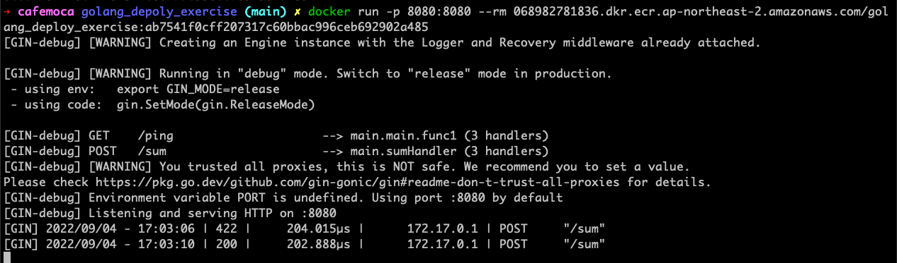

여기까지 action으로 테스트/배포 자동화와 ECR 연동방법을 알아보았다.

# RDS Connect

#
